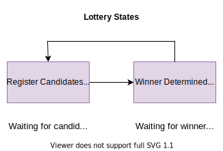

# Decentralized matching

A decentralized matching protocol for ErgoDEX.

## Problem statement

Initially ErgoDEX used a random off-chain matching which led to a certain centralization in orders processing due to 
technical advantage of some participants which were able to process most of the orders in the network faster.

## Solution

A decentralized lottery allowing to choose off-chain matcher on-chain for a certain period of time.

## Protocol description

DeMatch introduces a new primitive - a lottery contract. Lottery contact secures Lottery Box, which keeps Lottery State.

Fig. 1. Lottery states

### Lottery parameters

| Param               | Type      | Description
|---------------------|-----------|-----------
| `updateWindowLen`   | `Integer` | Length of a read-only window for seamless pool updates
| `registerWindowLen` | `Integer` | Length of a window when register for the next lottery is open
| `computeWindowLen`  | `Integer` | Length of a window withing which it's allowed to compute next matcher

### Protocol bootstrap

1. A new lottery box is created with a unique NFT as an identifier, an initial matcher PK and lottery settings (see "Lottery parameters")
2. ID of the LotteryNFT is copied to all new pools along with the initial marcher PK

### Main protocol flow

Fig. 2. Main protocol flow

1. Users willing to serve the network register their stakes in the lottery. To do that they append a tuple of `(S, PK)` 
   to the candidates array in the box and add the corresponding amount of collateral `Collateral = S`
2. Once previous epoch comes to an end a winner is selected as an entry `(S, PK)` with the highest weight 
   where weight of a lottery ticket is defined as: the ratio of the hash from the key pair of the ticket owner and
   the lottery seed modulo the collateral of the ticket owner to the sum of all the participants’ collateral.
   `Weight(PK_i) = H(PK_i | Seed) mod S_i div ΣS`. The winner's PK is written to `nextEpochBatcherPK`.
3. Once next epoch begins matcher PK for the epoch is copied to all pools.

Fig. 2. Lottery timeline

## Acquiring on-chain entropy 

TODO
